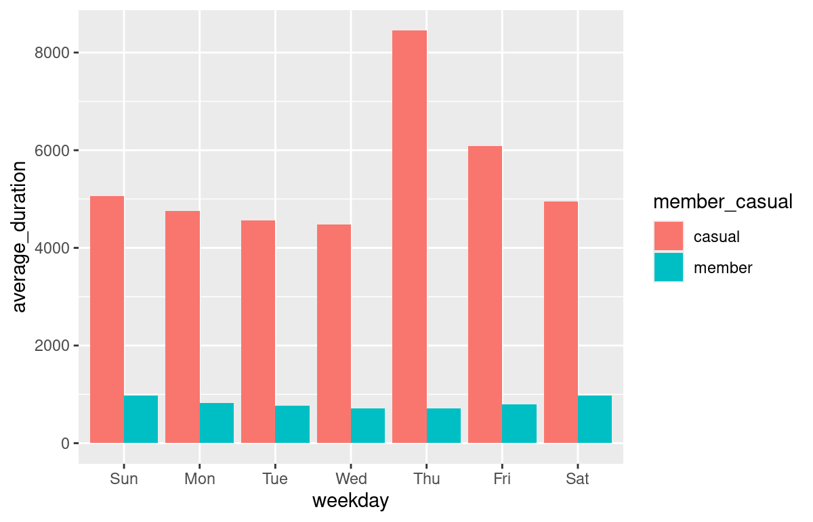

1. 專案名稱 (Project Title)

Divvy 自行車共享數據分析

2. 專案概述 (Project Overview)

這家虛擬公司相信，未來的成功仰賴訂閱制會員的增加。因此專案中想了解會員以及臨時用戶使用 Cyclistic 共享自行車服務的行為差異，從分析之中設想促進「臨時用戶轉換為會員用戶」的行銷策略。
這個專案旨在透過分析 Divvy 自行車共享公司 2019 年和 2020 年第一季的騎行數據，來比較會員用戶與臨時用戶的騎行行為和習慣。

3. 數據與工具 (Data & Tools)

數據來源：Google Data Analytics Professional Certificate Program: Divvy 自行車共享數據 (2019 Q1 & 2020 Q1) 
程式語言：R
主要套件：tidyverse (含 dplyr, ggplot2), lubridate

4. 主要發現與結論 (Key Findings & Conclusions)

臨時用戶：平均騎乘時間較長、騎乘次數較少且集中在週末，這可能表示他們更傾向於休閒騎行。
會員用戶：平均騎乘時間較短、騎乘次數較多且集中在平日，推測這群用戶將自行車用於短程通勤。

建議行銷策略：在 App 中推出會員三個月試用優惠，介紹公司站點的周邊環境，增加臨時用戶對 Cyclistic 通勤友善站點的認識，並且成為會員的話，贈送騎乘的折扣時數。

5. 如何查看報告 (How to View the Report)
[點此查看完整分析報告](https://github.com/zzIvyWang/Case-Study/blob/main/Cyclistic%20Bike-Share%20Analysis%20Case%20Study.md)

